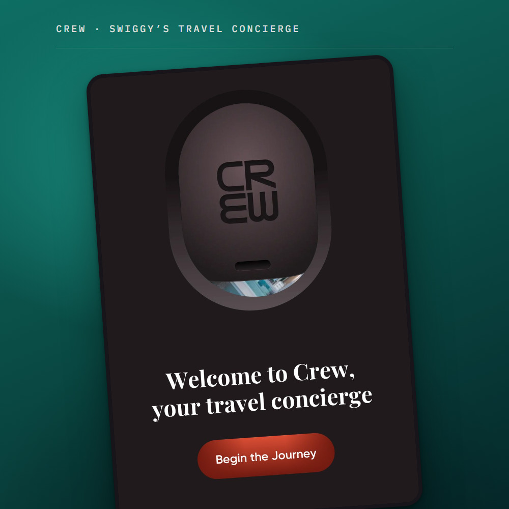

# Preview images for ritikadas.in

The pictures that sell an article before anyone reads it. Two jobs:

1. **The link preview.** Paste a `ritikadas.in` article link into Slack, WhatsApp,
   LinkedIn or X and a picture appears. That picture.
2. **The LinkedIn post image and the homepage card art.** Same design, different crops.

Written for whoever does the next one — person or agent. **CREW is finished and is the
reference.** Reddit and YouTube are half done and waiting on screenshots. When this
document and the actual images disagree, the images win.

Everything is generated by one script. Nothing is drawn by hand, and nothing is designed
in Figma. **Do not hand-edit a PNG or JPEG in `assets/og/`** — the next run overwrites it.

Companion document: `ARTICLE_PLAYBOOK.md`, which covers publishing the article itself.

---

## 1. One command

```
python3 tools/og-card.py            # rebuild every finished article
python3 tools/og-card.py reddit     # one article, including a held one
python3 tools/og-card.py crew:og    # one article, one variant
```

**Only CREW is finished, so a default run builds only CREW.** Reddit and YouTube are
marked `"hold": True` in the script because their art still uses a placeholder subject.
A default run skips them and says so. Nothing half-finished lands in `assets/og/`.

Needs Google Chrome installed at the standard macOS path. macOS only right now.

The first run downloads three webfonts and caches them in `tools/.fontcache/`. That
folder is gitignored, so a fresh clone needs one internet connection, once. After that
it runs offline.

---

## 2. What comes out

Three variants per article, named `<slug>-<variant>.jpg`, in `assets/og/`. Today that is
**three files, all CREW** — see §4 for why the other two are not there.

| Variant | Pixels | Weight | Used for |
|---|---|---|---|
| `<slug>-og.jpg` | 2400 × 1260 | ~215–250 KB | Link previews. Slack, WhatsApp, LinkedIn, X, iMessage. |
| `<slug>-square.jpg` | 2400 × 2400 | ~320–385 KB | LinkedIn image posts, Instagram. Posted by hand. |
| `<slug>-card.jpg` | 1000 × 1400 | ~96–117 KB | Hero inside the Product Thinking card on the homepage. |

**Only `-og.jpg` is wired into a page.** It sits in the `<meta>` tags of the article and
is fetched automatically by every platform. The other two are placed by hand — you upload
the square to LinkedIn, and the card one goes in the homepage markup.

Slugs are the same ones the rest of the site uses: `crew`, `reddit`, `youtube`.

**`assets/og/` holds finished work only.** A placeholder sitting in the repo is how a
placeholder ends up published, so a held article's files are deleted rather than
committed. Build one locally whenever you want to look at it.

---

## 3. Adding a new article

All the copy lives in one dictionary at the top of `tools/og-card.py`, called `ARTICLES`.
Add an entry, run the script, done. No layout code to touch.

```python
"reddit": {
    "hold":    True,                          # OPTIONAL — art unfinished, see §4
    "kicker":  "Product case study",          # the small pill next to the logo
    "title":   "Reddit Is a Waypoint, Not a Destination",
    "hook":    "Around 62% of Reddit's visitors arrive from Google, land on "
               "one thread, get their answer and leave.",
    "quote":   "Reddit users navigate Reddit by leaving Reddit.",   # OPTIONAL — see §5
    "byline":  "Reddit · Consumer social",    # the product's name, on the colour panel
    "brand":   "#FF4500", "rgb": "255,69,0",  # must match the tag on the homepage card
    "field":   ("#FF7A45", "#F04A00", "#A83204", "#4A1602"),   # bloom, top, mid, deep
    "icon":    "assets/reddit.svg", "icon_radius": 0,
    "subject": {"kind": "tile", "src": "assets/reddit.svg"},
},
```

### Where the words come from

**Take them off the homepage card, do not invent them.** Every article already has an
approved card in `index.html` with a title and a Problem row. That copy has been through
review. Reusing it means a reader who clicks the picture lands somewhere familiar.

- `title` — the card's `<h3>`, in title case.
- `hook` — the card's Problem row, trimmed to about two lines. This doubles as the
  `og:description`, so it is the sentence that appears next to the picture in Slack.
- `quote` — a single short line, if the article has one worth pulling. See §5.
- `byline` — what the product is, not what the article argues.

### Do not scrape the article

A card has room for one idea. The sentence that earns a click is almost never the page's
opening line. Choose deliberately.

---

## 4. When the Reddit and YouTube screenshots arrive

**This is the main unfinished job, and it is why no Reddit or YouTube files exist.**

Both articles are wired up and would render today, but their subject is a placeholder —
their logo on a paper tile, sitting on their brand colour. It looks finished and it is
not. CREW uses a real screenshot of the app and is visibly better. Rather than leave
plausible-looking stand-ins in the repo where they might get posted, both are marked
`"hold": True` and their files were deleted.

Both `writing-drafts/reddit/images/` and `writing-drafts/youtube/images/` are empty
today.

To see the current placeholder without committing it:

```
python3 tools/og-card.py reddit
```

When there are real screenshots:

1. Crop and size them the way `ARTICLE_PLAYBOOK.md` §6 describes, and put the web-sized
   file in `writing/<slug>/images/`.
2. Change one line in `ARTICLES`:

   ```python
   "subject": {"kind": "phone", "src": "writing/reddit/images/reddit-hero.jpg"},
   ```

3. **Delete that article's `"hold": True` line**, so default runs build it from now on.
4. Run `python3 tools/og-card.py reddit` and commit the three files.

That is the whole change. The `phone` subject draws the image inside a device frame and
positions it for every variant. **The screenshot should be a tall phone screen, roughly
2:3.** CREW's is 1080 × 1590. Something wider will be cropped to fit the frame.

Swapping to `phone` also drops the article's `quote` if you remove that key — read §5
before deciding, because CREW deliberately has no quote and Reddit and YouTube do.

---

## 5. The design rules

These were decided over several rounds with Ritika and are settled. Each one exists
because the alternative was tried and looked wrong. **Do not quietly revert them.**

### One logo per card. Never two.

The app tile appears once, next to the kicker pill on the paper side. It used to also sit
on the colour panel. Two copies of the same mark on one picture reads as a mistake, not
as branding. If the article's subject *is* its logo — Reddit and YouTube, until their
screenshots land — the panel gets no separate mark at all.

### The colour panel shows the product. It does not argue.

The panel carries the product's name and the product itself. Nothing else. No headline,
no explanation, no second sentence.

The argument belongs on the paper side, where the headline and hook already make it. CREW
originally had the line *"Every one of those is the work handed back"* on the panel. It
was removed because it restated the case study instead of showing the product.

### `quote` is optional, and that changes the layout

- **No `quote`** — the panel is a product plate. Name at the top, subject below, given the
  room the quote used to take. The name gets near-full contrast, because when it is the
  only text on the panel, being quiet just makes it hard to read. **This is CREW.**
- **With a `quote`** — the quote leads, the name sits under it as a smaller caption. Use
  this only when there is no screenshot and the panel needs something to carry it.
  **This is Reddit and YouTube today.** When their screenshots arrive, consider dropping
  their quotes too, so all three match.

### The headline is a scale, not a per-card setting

| | Rectangle | Square |
|---|---|---|
| Default | **62 px** | **88 px** |
| YouTube override | 68 px | 92 px |

It started at 70 and 100. Ritika found it too big, and she was right — the headline was
3.2× the hook and shouted. At 62 it is 2.8×, still an unmistakable hierarchy.

**Change the default, never one article's size.** The three cards sit in the same section
of the homepage and go into the same LinkedIn feed. A one-off font size quietly breaks the
family. YouTube has an override only because its title is short, and it keeps its
relative position when the default moves.

Line breaks are safe to leave alone. `max-width` is set in `ch`, which scales with the
font size, so changing the size does not re-wrap the headline.

### Read it at 396 pixels, not at full size

Nobody sees these at 2400 px. Slack renders a link preview about 396 px wide, WhatsApp
about 314 px. **A headline that only works at full size does not work.** Always check the
small end before approving anything.

---

## 6. The look, in tokens

Everything comes from the site's own `styles.css` variables, so the pictures and the site
cannot drift apart.

| | Value |
|---|---|
| Paper | `#EDE8E1`, with a warm wash so a flat fill does not read as dead colour |
| Ink | `#211E24` headline, `#6A6369` hook |
| Hairline | `#D5CCC1` |
| Headline font | Bricolage Grotesque 700, tracking `-.026em` |
| Hook font | Inter 450 |
| Labels and pills | IBM Plex Mono 500, uppercase, wide tracking |
| CREW | `#A62B22` |
| Reddit | `#FF4500` |
| YouTube | `#FF0000` |

The `ritika das` signature is **read out of `index.html` at build time**, not copied. If
the nav's mark ever changes, the pictures follow automatically.

Each article's colour panel is a four-stop gradient: a bright bloom, then a top, middle
and deep tone. The bloom matters — a dark screenshot on a dark panel disappears, so the
panel has to be warm enough to separate the device from its background.

---

## 7. The card hero and the crop maths

This one has a trap in it, and it already bit once.

The homepage card's media slot is one column of a `1.45fr / 1fr` grid. Inside a 1016 px
card that makes it about **400 px wide**. Its *height* comes from the card's own text, so
it varies — CREW's card has one lead paragraph, Reddit's and YouTube's have four rows.
The slot is filled with `object-fit: cover`, which crops whichever axis is surplus.

| Slot shape | What gets cut |
|---|---|
| 0.71 — about 400 × 560, the normal case | Nothing. The art matches this exactly. |
| 0.55 — a tall card | 115 px off **each side** |
| 0.85 — a short card | 176 px off top **and** bottom |

So:

- The canvas is **1000 × 1400**, which is 0.71. No crop at the expected size.
- **Every piece of text sits 150 px in from the left and right edges.** That is 35 px
  clear of the worst side trim. Text at a 72 px inset was being sliced mid-word.
- The bloom sits at **32% down**, not the 12% the full-bleed variants use. At 12% it fell
  outside the crop entirely, leaving a gradient with no visible source.
- The name at the top and the signature at the bottom are the first things lost on a
  short card. Neither carries meaning the rest of the picture does not.

**If you move text in the card variant, keep the 150 px inset.** If you change the
canvas height, redo the arithmetic.

---

## 8. Format and file size

All nine files are **JPEG, quality 92, with no chroma subsampling**. Not PNG. This is
deliberate and worth understanding before changing it.

- These pictures are photographic — a full-bleed gradient with a photo or logo on it.
  PNG serves that badly. The link previews were landing near 1 MB.
- **WhatsApp quietly stops showing a link preview above roughly 600 KB.** No error, no
  warning, the preview just does not appear.
- The three card heroes were 583–715 KB each as PNG. That is about 2 MB of homepage
  weight for a slot 400 px wide. As JPEG they total around 317 KB.
- "No chroma subsampling" is what keeps the coloured type from fringing at the edges. It
  costs a little size and is worth it.

The link previews are rendered at **2× device scale**: a 1200 × 630 layout captured at
2400 × 1260. Ritika reported the rectangle looking hazy, and this was why — at 1× a
retina screen was doubling every pixel, and the phone screenshot was being shrunk to
322 px wide and then stretched back up.

**Do not make it 1920 × 1080.** Facebook, LinkedIn, X and Slack all crop link previews to
1.91:1. A true 16:9 picture gets its top and bottom shaved by every one of them. 2400 ×
1260 is 1.91:1 at double density, which is sharpness without the crop.

The card hero stays at 1×. A 1000 px source for a 400 px slot already gives a retina
screen more pixels than it has. Rendering it at 2× would only add weight to a page asset.

---

## 9. Checking the work

### The preview page

`tools/preview.html` shows every image at the size it is actually seen — Slack at 396 px,
WhatsApp at 314 px, LinkedIn at 552 px, and the card hero inside a mock homepage card at
three different crop shapes.

Serve it over a local address rather than opening the file from Finder:

```
python3 -m http.server 8765
```

Then open `http://127.0.0.1:8765/tools/preview.html`.

### Testing the real link preview

Only works after the change is pushed and live, because every platform fetches the
picture from `https://ritikadas.in/...` from the outside.

- Facebook and WhatsApp — [developers.facebook.com/tools/debug](https://developers.facebook.com/tools/debug/),
  then **Scrape Again**. **This step is not optional if you changed an existing image**,
  because Facebook caches the old one indefinitely.
- LinkedIn — [linkedin.com/post-inspector](https://www.linkedin.com/post-inspector/)
- Slack — paste the link into a message to yourself.

---

## 10. Wiring the link preview into an article

Only `-og.jpg` needs this. The block lives in the article's `<head>`, and
`writing/crew/index.html` is the working example.

```html
<link rel="canonical" href="https://ritikadas.in/writing/crew/">
<meta property="og:type" content="article">
<meta property="og:site_name" content="Ritika Das">
<meta property="og:url" content="https://ritikadas.in/writing/crew/">
<meta property="og:title" content="...">
<meta property="og:description" content="...">
<meta property="og:image" content="https://ritikadas.in/assets/og/crew-og.jpg">
<meta property="og:image:type" content="image/jpeg">
<meta property="og:image:width" content="2400">
<meta property="og:image:height" content="1260">
<meta property="og:image:alt" content="...">
<meta name="twitter:card" content="summary_large_image">
<meta name="twitter:title" content="...">
<meta name="twitter:description" content="...">
<meta name="twitter:image" content="https://ritikadas.in/assets/og/crew-og.jpg">
```

Two things that silently produce no preview at all:

- **`og:image` must be a full `https://` address.** Every scraper fetches it with no
  page context, so a relative path yields nothing.
- The article must actually be live at that URL.

`og:description` should be the same sentence as the picture's `hook`, so the words next
to the picture and the words on it agree.

---

## 11. Still open

| Item | State |
|---|---|
| Reddit and YouTube real screenshots | **Waiting.** Both are `hold`, so no files are committed. See §4. |
| Card heroes placed on the homepage | **CREW done** 2026-08-04. Reddit and YouTube follow their screenshots. |
| Reddit and YouTube `<meta>` tags | **Blocked.** Those pages do not exist yet. |
| A link preview for the site itself | **Not done, and it matters more than the articles.** See below. |

### How the card hero is wired in

The CREW card carries `crew-card.jpg` in a restored media column:

```html
<div class="card written with-art reveal" data-project="crew">
  …
  <figure class="card-art">
    
  </figure>
```

`with-art` is what restores the second column — `.card.written .card-main-grid` collapses
written cards to one column by default, and that stays the default for a card with no art.

The art renders at its **natural aspect**, not `object-fit:cover`, so §7's crop maths does
not apply here — nothing is trimmed. At 1440 px the column resolves to 376 px and the art
lands 525 px tall, which sets the card's height (583 px, against ~700 px for the shipped
product cards — it no longer reads as the runt of the section).

Under 880 px it stacks and the art moves **above** the text with `order:-1`, capped at
300 px wide. Use `width` + `justify-self`, never `margin:0 auto` — auto margins cancel a
grid item's stretch, which collapsed the figure to 4 px until the image loaded.

The small inline logo that used to sit beside the card title was removed. Between the
section heading's tile, that inline mark and the logo inside the art itself, one logo was
appearing three times in one eyeful.

### The site's own link preview is still missing

`ritikadas.in` itself has no `og:` tags — only the CREW article does. The root URL is the
one that goes on a CV, a LinkedIn profile and in email, so it is pasted far more often than
any article link. It needs its own design, since there is no single product to show, and
`ARTICLES` has no `home` entry.

---

## 12. Ritika's standing preferences

Recorded because they came up repeatedly and they save a round trip.

**She has given design latitude, explicitly.** Her words, on 2026-08-04: if something
looks wrong or does not fit visually, change it and explain why. She does not consider
design a strength and would rather have a judgment call than a question. So:

- Do not ask permission for a visual fix you are confident about. Make it, then say what
  you changed and why in one or two sentences.
- **Flagging a problem and then leaving it is the wrong move.** The duplicated logo was
  spotted, described, and left in place for a round. Fixing it was the expected answer.
- The calls that are still hers: copy, what an article claims, and anything that changes
  what the site says about her.

**She is non-technical.** Explain what a change does for a reader, not how it works.
Lead with the consequence.

**On the pictures specifically:**

- No explanatory text on the image beyond the product's name.
- Headline restrained rather than large.
- The product should be the thing you look at.

---

## 13. Don't

- Don't hand-edit files in `assets/og/`. The next script run overwrites them.
- Don't put two copies of one logo on a card.
- Don't add a sentence to the colour panel to fill space. Space is the design.
- Don't set one article's headline size. Move the scale.
- Don't switch back to PNG without re-reading §8.
- Don't make the link preview 16:9.
- Don't reduce the card variant's 150 px text inset.
- Don't approve an image without looking at it at about 396 px wide.
- Don't invent copy the homepage card has already stated.
- Don't commit a held article's images. Delete them, or leave the `hold` flag on.
